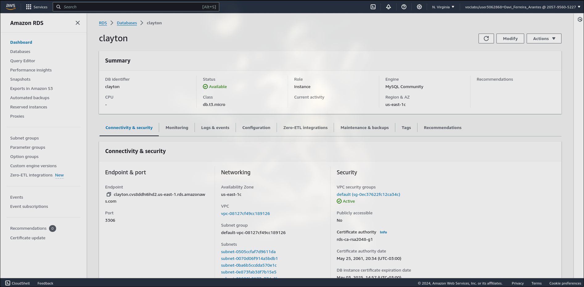
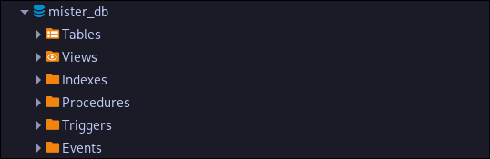

### Modelo lógico

<div align="center">
  <p>Modelo Lógico</p>
  
  <p>Fonte: elaborada pelos autores.</p>
</div>

### RDS

<div align="center">
  <p>RDS</p>
  
  <p>Fonte: elaborada pelos autores.</p>
</div>

### Banco criado

<div align="center">
  <p>Banco</p>
  
  <p>Fonte: elaborada pelos autores.</p>
</div>

### Query de calculo médio 

<div align="center">
  <p>Banco</p>
  
  <p>Fonte: elaborada pelos autores.</p>
</div>

### Observações
- O código SQL está dentro do arquivo `main.go`, para executar, crie uma RDS e altere a string de conexão, e depois execute: 

``` shell
go run main.go
```
